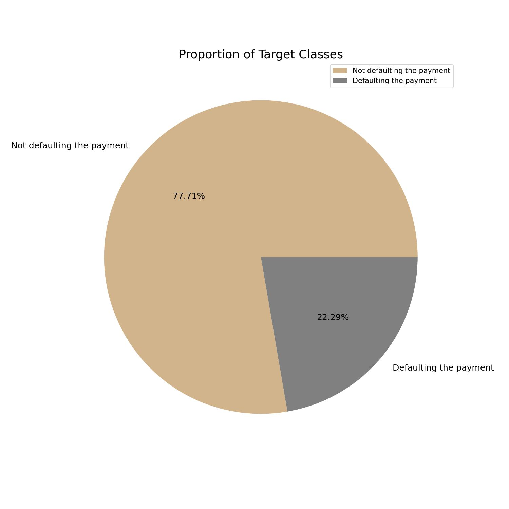
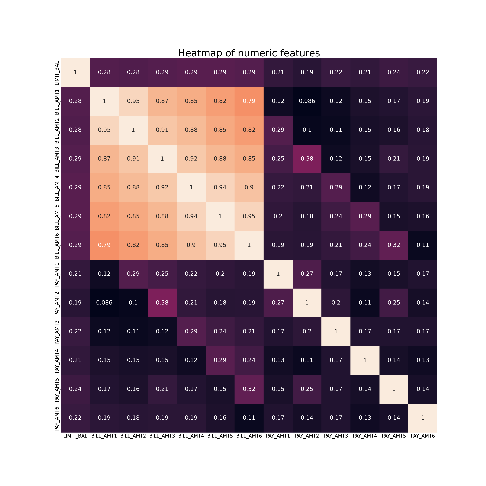
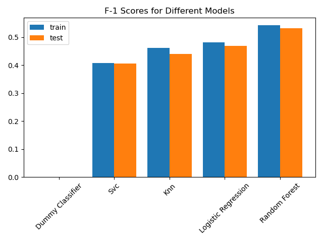
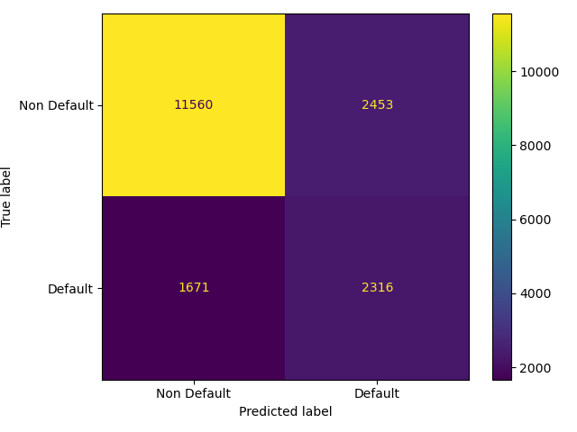

```{r setup, include=FALSE}
knitr::opts_chunk$set(echo = FALSE)
library(reticulate)
```

```{python load model results, include=FALSE}

import pandas as pd

final_test_results = pd.read_csv('../results/model_summary/test_f1_scores.csv', index_col=0)
test_score_svc = round(final_test_results.loc['svc'].iloc[0], 3)
test_score_rfc = round(final_test_results.loc['random_forest'].iloc[0], 3)
test_score_knn = round(final_test_results.loc['knn'].iloc[0], 3)
test_score_lr = round(final_test_results.loc['logistic_regression'].iloc[0], 3)

```

## Introduction

For the project, we are trying to answer the question that given a credit card customer's payment history and demographic information like gender, age, and education level, would the customer default on the next bill payment? A borrower is said to be in default when they are unable to make their interest or principal payments on time, miss installments, or cease making them altogether. The answer to this query is crucial since it allows financial organizations to assess a customer's creditworthiness and set suitable credit limit ranges using an efficient predictive model. It also helps them take preemptive actions to secure their assets. Due to the class imbalance, we must evaluate the model's effectiveness using different metrics, such as precision, recall, or F1 score. Our model's primary focus is the class "default payment," which refers to payment defaults made by clients. As a result, we are treating `default` as the positive class, and `not defaulting` as the negative class. In this case, it is important for financial institutions to identify potential clients that may make a default payment. 

Our objective is to predict as many default payments as we can with accuracy. In other words, we are maximizing the number of true positives while reducing false positives as much as possible. Thus, they can prevent asset loss in advance. Additionally, Type II errors are also important since it will be costly for the institutions to assume people, who can make the payment, would default as it would affect the organization's reputation. Therefore, we need to balance both Types of errors and the best way would be to score the model on the F1 score as it is the harmonic mean of recall which shows many among all positive examples are correctly identified and precision which shows how many among the positive examples are truly positive.

In this report, we attempt to use machine-learning algorithms to predict whether a client would default a payment or not, given a set of the client's information. 

### Data

The data set used in the project was produced by Yeh, I. C., and Lien, C. H., and it is freely accessible for download at the UCI Machine Learning Repository [@uci_ml_data_set] (with the title "default of credit card clients" in 2016). The [dataset](<https://github.com/UBC-MDS/credit_default_prediction_group_20/tree/main/data/raw>) is based on examples of Taiwanese credit card clients defaulting from April to September. Each observation in the 30000-observation dataset reflects the data of a certain client. The dataset has no missing values and has 24 features which are gender, age, marital status, ID, Repayment Status, and Bill and Pay amounts. The final target indicates whether the client will default or not. The 24 features can be groups as categorical, numeric, and binary.

Some of the key pre-processings performed in the data includes:
- As ID is the ID of each client, which is unique, feature is dropped. 
- Despite being categorical in nature, SEX will be regarded as a binary value. 
- As there are unknown values in the `EDUCATION` feature, they were combined and grouped along with "Others". Finally, the categories were encoded as 1 for high school, 2 for university, 3 for graduate school, and 4 for others. 
- As there are unknown values in the `MARRIAGE` feature, they were combined and grouped along with "Others". Finally, the categories were encoded as 1 for married, 2 for single, 3 for others.

As shown in the figure 1. pie chart for target, the target (default payment next month) is an imbalanced feature. There are more cases of not defaulting than defaulting. 

<center>  

  

Figure 1. pie chart for target

</center>

The BILL AMT features, the features that reflect the bill amount for each month during the six months from April to September 2005, where BILL AMT1 indicates the bill amount for April, show strong positive correlations. From this, we can infer that larger monthly bill amounts would probably result in higher monthly bill amounts the following month. Also, this could be due to the accumulation of debt as a result of late payments. Although BILL AMT features have a high correlation amongst themselves, most features have poor linear correlation against the target since Pearson Correlation Coefficient against the target for most features is low. 

<center>

  

Figure 2. Correlation graph

</center>


### Process and Analysis

The prediction problem at hand is a binary classification problem where we're asked to predict whether the client would default a payment or not. As part of the machine learning process, we split the data into training and test split at a 50% split followed by which we train 4 classification models, the Dummy Classifier for baseline, Random Forest Classifier, KNN, SVC, and Logistic Regression. As we're performing hyperparameter optimization on all models, a split of 50% is optimum in ensuring the training of models along with finding the right hyperparameters, while keeping a significant chunk of the data for testing.

The best hyperparameters for each of the models (apart from the dummy classifier) were done with a randomized search to have control over the number of iterations performed. Additionally, the randomized search was done with the intention of optimizing the “F1” score.  Once the model was refit on the training data with the best parameters from the randomized search, we performed a 10-fold cross validation with metrics "f1", "accuracy", "precision", and "recall" to understand how each model is performing in terms of both Type I and Type II errors.

Once, we narrow down on the model that is performing that best on the training data, we finally score the model on the test data. 

For the purposes of machine learning and report generation, the Python programming language [@pilgrim2009dive] and the following Python packages docopt [@docoptpython], sklearn [@scikit-learn], altair [@altair], pandas [@pandas], numpy [@numpy-Array], os [@pilgrim2009dive], requests [@van1995python], joblib [@van1995python], matplot [@matplotlib] were used. Additionally, we used R programming language [@R] and the following packages: knitr [@knitr], tidyverse [@tidyverse] for generating this report. 

## Results & Discussion

### Baseline Model and Discussion
To set the baseline of each of the model performances, we first trained the dummy classifier. For dummy classifier, most of the classification metrics apart from accuracy are 0 since dummy classifier would always predict `Not Defaulting` in this problem causing True Positives and False Positive to be 0 causing precision, recall, and F1 scores to be 0. 

### Comparing RandomForestClassifier, KNeighborsClassifier, SVC, LogisticRegression

Since we're it is crucial to reduce both Type I and Type II errors, we'll evaluate all the models based on the F1 score. From the initial cross-validation results, we can see that both RandomForestClassifier and SVC have better F1 scores when compared to KNeighborsClassifier and LogisticRegression. Hence, for our final model, we eliminate KNeighborsClassifier and LogisticRegression. On comparing RandomForestClassifier and SVC, we see that both of them have approximately the same F1 scores. RandomForestClassifier and SVC differ in the fact that SVC can lower Type II errors better than RandomForestClassifier as SVC has a higher recall score. Conversely, RandomForestClassifier is performing well in terms of lowering the Type I errors. Since it is of paramount importance to reduce the false negatives introduced by the model, pick SVC to move forward. 


<center>

   

Table 3. Cross Validation Results of the optimized Models.

</center>

After fixing our primary model, we analyze how each of the models are scoring againt the test data. Showcasing our top models first, we see that SVC had a final F1 test score of `r py$test_score_svc` while RandomForestClassifier has a F1 test score of `r py$test_score_rfc`. As expected, RandomForestClassifier is performing better in terms of F1. The models KNN and LogisticRegression has F1 test scores of `r py$test_score_knn` and `r py$test_score_lr` respectively. 

<center>

   

Figure 3. RandomForestClassifier and SVC outperforms other models.

</center>


<center>

  

Figure 4. Confusion matrix of SVC.

</center>

## Improvement and limitation
Understanding the limitations and assumptions made during the prediction process plays a crucial role in understanding the validity and reliability of the results. One of the critical limitations that blocks us from extrapolating the results to the present day is that the data is old (taken in 2005), and there have been significant change in human nature and patterns since 2005. There are limitations also introduced due to the presence of data that was absent in the metadata for the features EDUCATION and MARRIAGE. These features contain unknown levels which are not described in the documentation. With number of defaulters at approximately at 25%, the number of defaulters is relatively large compared to what we would expect in real life. This could be due an efffect of Taiwanese economy this time period or could be due to improper data collection. To improve the analysis, we could perform feature enginneering based on expert domain knowledge that could boost the model performance. Although we have analyzed the performance of RFC, KNN, SVC, and LR, we could try analyzing the performance GradientBoostingClassifier. We could have also tried using SMOTE or a different method of handling class imbalance. To generalize the analysis to the current years, the first step would be to take more recent data that includes more features such as asset to debt ratio, occupation, income, and household size. It would also be better to get the data across varias other countries to better train our model on the trends in credit default payments. 


## References
