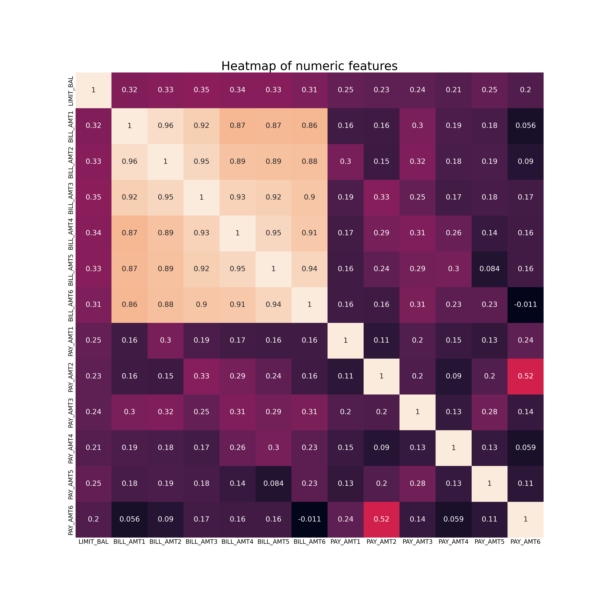
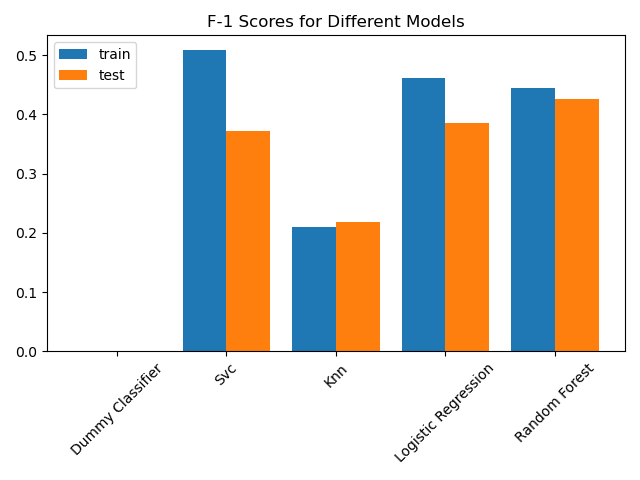
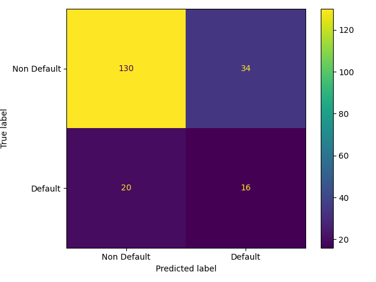
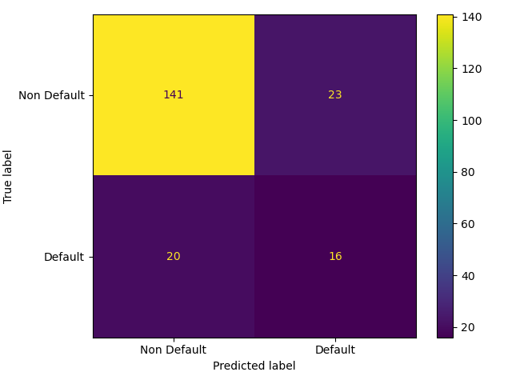

```{r setup, include=FALSE}
knitr::opts_chunk$set(echo = FALSE)
library(tidyverse)
library(reticulate)
library(knitr)
library(kableExtra)
```

```{python load model results, include=FALSE}

import pandas as pd

final_test_results = pd.read_csv('../results/model_summary/test_f1_scores.csv', index_col=0)
test_score_svc = round(final_test_results.loc['svc'].iloc[0], 3)
test_score_rfc = round(final_test_results.loc['random_forest'].iloc[0], 3)
test_score_knn = round(final_test_results.loc['knn'].iloc[0], 3)
test_score_lr = round(final_test_results.loc['logistic_regression'].iloc[0], 3)

```

This data analysis project was created for DSCI 522: Data Science Workflows, a course in the Master of Data Science program at the University of British Columbia.

## Contributors

- Arjun Radhakrishnan
- Morris Zhao
- Ken Wang
- Fujie Sun

## Introduction

For the project, we are trying to answer the question that given a credit card customer's payment history and demographic information like gender, age, and education level, would the customer default on the next bill payment? A borrower is said to be in default when they are unable to make their interest or principal payments on time, miss installments, or cease making them altogether. The answer to this query is crucial since it allows financial organizations to assess a customer's creditworthiness and set suitable credit limit ranges using an efficient predictive model. It also helps them take preemptive actions to secure their assets. Due to the class imbalance, we must evaluate the model's effectiveness using different metrics, such as precision, recall, or F1 score. Our model's primary focus is the class "default payment," which refers to payment defaults made by clients. As a result, we are treating `default` as the positive class, and `not defaulting` as the negative class. In this case, it is important for financial institutions to identify potential clients that may make a default payment.

Our objective is to maximize the number of true positives while reducing false positives as much as possible. Thus, they can prevent asset loss in advance. Additionally, Type II errors are also important since it will be costly for the institutions to assume people, who can make the payment, would default as it would affect the organization's reputation. Therefore, we need to balance both Types of errors and the best way would be to score the model on the F1 score as it is the harmonic mean of recall which shows many among all positive examples are correctly identified and precision which shows how many among the positive examples are truly positive. If there is a tie in the F1 score, we aim to reduce the number of Type II errors or false negatives.

In this report, we attempt to use machine-learning algorithms to predict whether a client would default a payment or not, given a set of the client's information.

### Data

The data set used in the project was produced by Yeh, I. C., and Lien, C. H., and it is freely accessible for download at the UCI Machine Learning Repository [@uci_ml_data_set] (with the title "default of credit card clients" in 2016). The [dataset](<https://github.com/UBC-MDS/credit_default_prediction_group_20/tree/main/data/raw>) is based on examples of Taiwanese credit card clients defaulting from April to September. Each observation in the 30000-observation dataset reflects the data of a certain client. The dataset has no missing values and has 24 features which are gender, age, marital status, ID, Repayment Status, and Bill and Pay amounts. The final target indicates whether the client will default or not. The 24 features can be grouped as categorical, numeric, and binary.

Some of the key pre-processing performed in the data includes:
- As ID is the ID of each client, which is unique, the feature is dropped.
- `SEX` will be regarded as a binary value since the data contains binary values.
- As there are unknown values in the `EDUCATION` feature, they were combined and grouped along with "Others". Finally, the categories were encoded as 1 for high school, 2 for university, 3 for graduate school, and 4 for others.
- As there are unknown values in the `MARRIAGE` feature, they were combined and grouped along with "Others". Finally, the categories were encoded as 1 for married, 2 for single, and 3 for others.

As shown in Figure 1, the target is an imbalanced feature.

```{r out.width = '75%', out.height = '75%', fig.align='center', fig.cap = "Figure 1. The proportion of people who do not default is greater."}
knitr::include_graphics("../results/eda/images/target_proportion.jpg")
```

The BILL AMT features, the features that reflect the bill amount for each month during the six months from April to September 2005, where BILL AMT1 indicates the bill amount for April, show strong positive correlations. From this, we can infer that higher monthly bill amounts would probably result in a higher monthly bill the following month. Also, this could be due to the accumulation of debt as a result of late payments. Although BILL AMT features have a high correlation amongst themselves, most features have poor linear correlation against the target since Pearson Correlation Coefficient against the target for most features is low.

```{r out.width = '100%', out.height = '100%', fig.align='center', fig.cap = "Figure 2. Pearson Correlation Graph highlighting the linear dependency between features."}

```


### Process and Analysis

The prediction problem at hand is a binary classification problem where we're asked to predict whether the client would default a payment or not. As part of the machine learning process, we split the data into training and test split at a 50% split followed by which we trained 5 classification models, the Dummy Classifier for baseline, Random Forest Classifier, KNN, SVC, and Logistic Regression. As we're performing hyperparameter optimization on all models, a split of 50% is optimum in ensuring the training of models along with finding the right hyperparameters, while keeping a significant chunk of the data for testing.

The best hyperparameters for each of the models (apart from the dummy classifier) were done with a randomized search to have control over the number of iterations performed. Additionally, the randomized search was done with the intention of optimizing the “F1” score.  Once the model was refit on the training data with the best parameters from the randomized search, we performed a 10-fold cross-validation with metrics "f1", "accuracy", "precision", and "recall" to understand how each model is performing in terms of both Type I and Type II errors.

As there was a tie in the F1 score, we picked the model with a lower Type II error. Once, we finalized the model that is performing best on the training data, we finally scored the model on the test data and presented the findings.

For machine learning and report generation, the Python programming language [@pilgrim2009dive] and the following Python packages docopt [@docoptpython], sklearn [@scikit-learn], altair [@altair], pandas [@pandas], numpy [@numpy], os [@pilgrim2009dive], requests [@van1995python], joblib [@van1995python], matplot [@matplotlib] were used. Additionally, we used R programming language [@team2013r] and the following packages: knitr [@knitr], tidyverse [@tidyverse] for generating this report.

## Results & Discussion

### Baseline Model
To set the baseline of each of the model performances, we first trained the dummy classifier. For the dummy classifier, most of the classification metrics apart from accuracy are 0 since the dummy classifier would always predict `Not Defaulting` in this problem, causing True Positives and False Positives to be 0, causing precision, recall, and F1 scores to be 0.

### Comparing RandomForestClassifier, KNeighborsClassifier, SVC, LogisticRegression

Since we're it is crucial to reduce both Type I and Type II errors, we'll evaluate all the models based on the F1 score. From the initial cross-validation results, we can see that both `RandomForestClassifier` and `SVC` have better F1 scores when compared to `KNeighborsClassifier` and `LogisticRegression`. Hence, for our final model, we will eliminate `KNeighborsClassifier` and `LogisticRegression`.

On comparing `RandomForestClassifier` and `SVC`, we see that both of them have approximately the same F1 scores. As there is a tie in the F1 scores, we pick the model with lower Type II errors. As `SVC` has a higher recall score, `SVC` can lower Type II errors better than `RandomForestClassifier`. Conversely, `RandomForestClassifier` is performing well in terms of lowering the Type I errors. Since it is of paramount importance to reduce the false negatives introduced by the model, we pick `SVC` to move forward.

```{r print model results, message=FALSE, warning=FALSE, echo=FALSE}

cols <- c(
  "Metric", "Dummy", "Random Forest Classifier",
  "Random Forest Classifier Optimized", "kNN", "kNN Optimized",
  "SCV", "SCV Optimized", "Logistic Regression ",
  "Logistic Regression Optimized"
)

cv_result_table <- read_csv("../results/cross_validation_results.csv",
  skip = 1, col_names = cols
)

subset <- select(
  cv_result_table, "Metric", "Dummy",
  "Random Forest Classifier Optimized", "kNN Optimized",
  "SCV Optimized", "Logistic Regression Optimized"
)

knitr::kable(subset, caption = "Table 1. Cross Validation Results") |>
  kableExtra::kable_styling(full_width = FALSE)
```

### Score Analysis

After fixing our primary model as `SVC`, we analyze how each of the models is scoring against the test data. Showcasing our top models first, we see that SVC had a final F1 test score of `r py$test_score_svc` while `RandomForestClassifier` has an F1 test score of `r py$test_score_rfc`. As expected, `RandomForestClassifier` is performing better in terms of F1. Although this is the case, as we saw previously, `SVC` has lower Type II errors. The models KNN and LogisticRegression have F1 test scores of `r py$test_score_knn` and `r py$test_score_lr` respectively.

```{r out.width = '75%', out.height = '75%', fig.align='center', fig.cap = "Figure 3. `RandomForestClassifier` and `SVC` outperforms other models."}

```

From the confusion matrix for the `SVC` model, we see that the number of Type II errors or false negatives (actually defaulting but predicting not-defaulting) is lower than the number of Type I errors (actually not-defaulting but predicting defaulting).

Hence, among the models that we analyzed, `SCV` performs the best in terms of lowering the Type II errors while simultaneously optimizing the F1 and precision scores. If the organization is more interested in lowering the Type I errors to improve customer satisfaction, we recommend using `RandomForestClassifier` over `SVC` as both have comparable F1 scores.

```{r out.width = '50%', out.height = '50%', fig.align='center', fig.cap = "Figure 4. Confusion matrix of SVC."}

```

```{r out.width = '50%', out.height = '50%', fig.align='center', fig.cap = "Figure 4. Confusion matrix of RandomForestClassifier. Relative to SVC, RandomForestClassifier has higher Type II error."}

```

## Limitations, Assumptions, and Future Work
Understanding the limitations and assumptions made during the prediction process plays a crucial role in understanding the validity and reliability of the results. One of the critical limitations that block us from extrapolating the results to the present day is that the data is old (taken in 2005), and there have been significant changes in human nature and patterns since 2005. There are limitations also introduced due to the presence of data that was absent in the metadata for the features `EDUCATION` and `MARRIAGE`. These features contain unknown levels which are not described in the documentation. With the number of defaulters at approximately 25%, the number of defaulters is relatively large compared to what we would expect in real life. This could be due to an effect of the Taiwanese economy during this period or could be due to improper data collection. To improve the analysis, we could perform feature engineering based on expert domain knowledge that could boost the model performance. Although we have analyzed the performance of `RandomForestClassifier`, `KNeighborsClassifier`, `SVC`, and `LogisticRegression`, we could try analyzing the performance of `GradientBoostingClassifier`. We could have also tried using SMOTE or a different method of handling class imbalance. To generalize the analysis to the current years, the first step would be to take more recent data that includes more features such as asset-to-debt ratio, occupation, income, and household size. It would also be better to get the data across various other countries to better train our model on the trends in credit default payments.


## References
